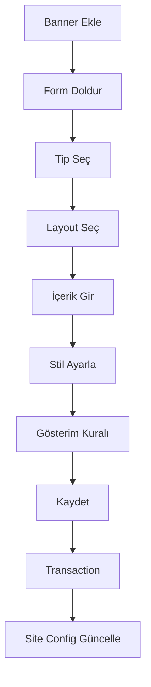
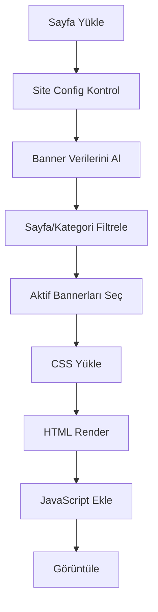

# Banner Sistem Dokümantasyonu

## 📋 İçindekiler
1. [Genel Bakış](#genel-bakış)
2. [Veritabanı Yapısı](#veritabanı-yapısı)
3. [Model Yapısı](#model-yapısı)
4. [Controller Yapısı](#controller-yapısı)
5. [Banner Tipleri](#banner-tipleri)
6. [Layout Sistemleri](#layout-sistemleri)
7. [İşleyiş Akışı](#işleyiş-akışı)
8. [Render Süreci](#render-süreci)
9. [CSS/JS Yönetimi](#cssjs-yönetimi)
10. [Kullanım Örnekleri](#kullanım-örnekleri)

---

## 🎯 Genel Bakış

Banner sistemi, web sitesinde dinamik olarak farklı konumlarda görüntülenebilen içerik bloklarını yönetmek için tasarlanmış kapsamlı bir sistemdir. Sistem 6 temel tablo ile çalışır ve admin panelinden tamamen yönetilebilir.

### Temel Özellikler:
- **Çoklu Banner Tipi:** Slider, Tepe Banner, Orta Banner, Alt Banner, Popup, Carousel
- **Esnek Layout:** Tekli, ikili, üçlü, dörtlü, beşli düzenler
- **Dil Desteği:** Çoklu dil desteği ile farklı dillerde banner yönetimi
- **Koşullu Gösterim:** Sayfa, kategori ve dil bazlı gösterim kuralları
- **Stil Yönetimi:** Her banner için özelleştirilebilir stil ayarları
- **Responsive:** Mobil uyumlu tasarım

---

## 🗃️ Veritabanı Yapısı

### 1. `banner_types` - Banner Tipleri
```sql
- id (Primary Key)
- type_name (VARCHAR 50) - Banner tip adı
- description (TEXT) - Açıklama
```

**Varsayılan Banner Tipleri:**
1. **Slider** - Ana sayfa üst slider
2. **Tepe Banner** - Sayfa üst banner
3. **Orta Banner** - Sayfa içi banner
4. **Alt Banner** - Sayfa alt banner
5. **Karşılama Banner (Popup)** - Popup banner
6. **Carousel Slider** - Dönen carousel banner
7. **Başlık Banner** - Kategori/sayfa başlık banner

### 2. `banner_layouts` - Banner Düzenleri
```sql
- id (Primary Key)
- layout_group (VARCHAR 50) - Grup türü (text, image, text_and_image)
- layout_view (VARCHAR 20) - Görünüm (single, multi. İki modu var. Örneğin tepe banner birden fazla bannerdan oluşmaz.)
- type_id (INT) - Banner tipi referansı (table: banner_types)
- layout_name (VARCHAR 100) - Layout adı
- description (TEXT) - Açıklama
- columns (INT) - Sütun sayısı
- max_banners (INT) - Maximum banner sayısı
- created_at, updated_at
```

### 3. `banner_groups` - Banner Grupları
```sql
- id (Primary Key)
- group_name (VARCHAR 100) - Grup adı
- group_title (VARCHAR 100) - Grup başlığı (girilmişse hr etiketi içinde gösterilir)
- group_desc (VARCHAR 255) - Grup açıklaması (girilmişse ğ etiketi içinde gösterilir)
- layout_id (INT) - Layout referansı
- group_kind (VARCHAR 100) - Grup türü (text_and_image,only_text,only_image. banner html yapısı oluştururken önemli)
- group_view (VARCHAR 20) - Grup görünümü, css sınıfı olarak atanır (single, yanyana görünümler için double, triple, quad, quinary)
- columns (INT) - Sütun sayısı
- content_alignment (ENUM) - İçerik hizalama (horizontal/vertical)
- style_class (VARCHAR 50) - CSS sınıfı
- background_color (VARCHAR 50) - Arka plan rengi (banner grubunun arkaplan rengi)
- group_title_color (VARCHAR 50) - Başlık rengi
- group_desc_color (VARCHAR 50) - Açıklama rengi
- group_full_size (TINYINT) - Tam boyut ayarı (1 ise banner grubunun ana konteynırı 100%, 0 ise var(--content-max-width) olarak ayarlanır.)
- custom_css (TEXT) - Özel CSS
- order_num (INT) - Sıralama numarası
- visibility_start/end (DATETIME) - Görünürlük tarihleri
- banner_duration (INT) - Banner süresi
- banner_full_size (TINYINT) - Banner tam boyut (banner grubundaki her bir bannerın 1 ise 100%, 0 ise var(--content-max-width) ayarlanmasını sağlar.)
- created_at, updated_at
```

### 4. `banner_styles` - Banner Stilleri (her bir bannerın isteğe bağlı özelleştirilmesi)
```sql
- id (Primary Key)
- banner_height_size (INT) - Banner yüksekliği
- background_color (VARCHAR 25) - Arka plan rengi
- content_box_bg_color (VARCHAR 25) - İçerik kutusu arka plan
- title_color (VARCHAR 25) - Başlık rengi
- title_size (INT) - Başlık boyutu
- content_color (VARCHAR 25) - İçerik rengi
- content_size (INT) - İçerik boyutu
- show_button (TINYINT) - Buton göster/gizle
- button_title (VARCHAR 50) - Buton başlığı
- button_location (INT) - Buton konumu (0-9 arası)
- button_background (VARCHAR 25) - Buton arka plan
- button_color (VARCHAR 25) - Buton metin rengi
- button_hover_background (VARCHAR 25) - Buton hover arka plan
- button_hover_color (VARCHAR 25) - Buton hover metin rengi
- button_size (INT) - Buton boyutu
- created_at, updated_at
```

### 5. `banners` - Banner İçerikleri
```sql
- id (Primary Key)
- group_id (INT) - Banner grup referansı
- style_id (INT) - Banner stil referansı
- title (VARCHAR 255) - Banner başlığı
- content (TEXT) - Banner içeriği
- image (VARCHAR 255) - Banner görseli
- link (VARCHAR 255) - Banner linki
- active (TINYINT) - Aktif/pasif
- created_at, updated_at
```

### 6. `banner_display_rules` - Gösterim Kuralları (page_id ve category_id boş ise banner tüm sitede görünür)
```sql
- id (Primary Key)
- group_id (INT) - Banner grup referansı
- type_id (INT) - Banner tip referansı
- page_id (INT) - Sayfa ID (opsiyonel) (girilmişse banner id'si eşleşen sayfalarda görünür)
- category_id (INT) - Kategori ID (opsiyonel) (girilmişse banner id'si eşleşen kategorilerde görünür)
- language_code (VARCHAR 10) - Dil kodu
- created_at, updated_at
```

---

## 🏗️ Model Yapısı

### Admin Models (`App/Model/Admin/AdminBannerModel.php`)

#### 1. `AdminBannerTypeModel`
- `getAllTypes()` - Tüm banner tiplerini getirir
- `getTypeById($id)` - ID'ye göre banner tipi
- `addType()`, `updateType()`, `deleteType()` - CRUD işlemleri

#### 2. `AdminBannerLayoutModel`
- `getAllLayouts()` - Tüm layoutları getirir
- `getLayoutsByTypeId($type_id)` - Tipe göre layoutlar
- Layout CRUD işlemleri

#### 3. `AdminBannerGroupModel`
- `getAllGroups()` - Tüm grupları getirir
- `getGroupById($id)` - ID'ye göre grup
- `addGroup()` - Yeni grup ekleme (19 parametre!)
- `updateGroup()` - Grup güncelleme
- `deleteGroup()` - Grup silme
- Transaction yönetimi (`beginTransaction`, `commit`, `rollback`)

#### 4. `AdminBannerStyleModel`
- Style CRUD işlemleri
- 15+ stil parametresi yönetimi

#### 5. `AdminBannerModel`
- Banner CRUD işlemleri
- `getBannersByGroupID()` - Gruba göre bannerlar

#### 6. `AdminBannerDisplayRulesModel`
- Gösterim kuralları yönetimi
- Dil ve tip bazlı filtreleme

### Frontend Models (`App/Model/BannerModel.php`)

Frontend modelleri sadece veri okuma işlemleri yapar:
- `BannerTypeModel`
- `BannerLayoutModel`
- `BannerGroupModel`
- `BannerStyleModel`
- `BannerModel`
- `BannerDisplayRulesModel`

---

## 🎮 Controller Yapısı

### 1. `AdminBannerModelController.php`

#### Ana İşlemler:
```php
// Banner tiplerini getir
GET /admin/banner?action=getBannerTypes

// Tipe göre layoutları getir
GET /admin/banner?action=getBannerLayouts&bannerTypeID=1

// Banner ekle/güncelle
POST /admin/banner?action=addBanner|updateBanner
```

#### `addBanner/updateBanner` İşlem Adımları:
1. **Parametre Validasyonu**
   - bannerGroupName, bannerTypeID, bannerLayoutID zorunlu
   - languageID, bannerLocation, tarih alanları kontrol

2. **Transaction Başlat**
   ```php
   $bannerGroupModel->beginTransaction("bannerGroup");
   ```

3. **Banner Grup İşlemleri**
   - Yeni grup: `addGroup()` - 19 parametre
   - Güncelleme: `updateGroup()` + mevcut bannerları sil

4. **Banner Stilleri Ekle**
   - Her banner için stil verilerini işle
   - `addStyle()` ile stil tablosuna ekle

5. **Banner İçerikleri Ekle**
   - Her banner için: başlık, içerik, görsel, link
   - `addBanner()` ile banners tablosuna ekle

6. **Gösterim Kuralları**
   ```php
   if ($bannerLocation == 0) { // Tüm sayfalar
   } elseif ($bannerLocation == 1) { // Belirli sayfalar
   } elseif ($bannerLocation == 2) { // Belirli kategoriler
   ```

7. **Site Config Güncelle**
   - Cache'i geçersiz kıl
   - Version numarasını artır

8. **Transaction Commit**

### 2. `BannerController.php` - Frontend Banner Renderer

#### Ana Metodlar:

```php
// Tipe göre banner render
public function renderBannersByType($typeId, $pageId, $categoryId)

// Özel tip renderlama
public function renderSliderBanners()      // Tip 1
public function renderTopBanners()         // Tip 2  
public function renderBottomBanners()      // Tip 4
public function renderPopupBanners()       // Tip 5

// Tüm tipleri render
public function renderAllBannerTypes()
```

#### Render İşlem Akışı:
1. **Banner Filtreleme**
   - Sayfa/kategori ID'sine göre filtrele
   - Aktif bannerları getir
   - Tarih aralığını kontrol et

2. **CSS Yükleme**
   - Banner tipine özel CSS
   - Layout bazlı CSS
   - Dinamik stil CSS'i oluştur

3. **HTML Oluşturma**
   - Banner tipine göre HTML yapısı
   - Container ve wrapper sınıfları
   - İçerik yerleştirme

4. **JavaScript Ekleme**
   - Slider için JS
   - Carousel için JS
   - Popup kontrolleri

---

## 🎨 Banner Tipleri ve Özellikleri

### 1. **Slider Banner (Tip 1)**
- **Kullanım:** Ana sayfa üst slider
- **Layout Seçenekleri:**
  - `fullwidth` - Tam genişlik
  - `box-double` - İkili kutu
  - `box-triple` - Üçlü kutu
  - `box-quad` - Dörtlü kutu
- **JavaScript:** Otomatik geçiş, fade/slide efekt
- **CSS:** `slider.css` yüklenir

### 2. **Tepe Banner (Tip 2)**
- **Kullanım:** Sayfa üst alanı
- **Layout:** `top-banner`
- **Özellik:** Genellikle tek banner
- **CSS:** `top-banner.css`

### 3. **Orta Banner (Tip 3)**
- **Kullanım:** Sayfa içi banner
- **Layout Seçenekleri:**
  - `single` - Tekli
  - `double` - İkili
  - `triple` - Üçlü
  - `quad` - Dörtlü
  - `quinary` - Beşli
- **CSS:** `middle-banner.css`

### 4. **Alt Banner (Tip 4)**
- **Kullanım:** Sayfa alt alanı
- **Layout:** `bottom-banner`
- **CSS:** `bottom-banner.css`

### 5. **Popup Banner (Tip 5)**
- **Kullanım:** Karşılama popup'ı
- **Layout:** `popup-banner`
- **JavaScript:** Modal kontrolleri, cookie yönetimi
- **CSS:** `popup-banner.css`

### 6. **Carousel Banner (Tip 6)**
- **Kullanım:** Dönen carousel
- **JavaScript:** Özel carousel kontrolleri
- **CSS:** `carousel.css`

---

## ⚙️ Layout Sistemleri

### Layout Group Türleri:
1. **`text`** - Sadece metin
2. **`image`** - Sadece görsel  
3. **`text_and_image`** - Metin + görsel

### Layout Group Türleri (css sınıfı olarak atanır):
- `fullwidth` - Ana slider için klasik slayt
- `carousel` - Ana slider için carousel görünüm
- `top-banner` - Tepe Banner için Arkaplan Resim ve Yazı Ortalı
- `Carousel` - Orta banner için Carousel görünümü
- `ImageRightBanner` - Orta banner için resim sağda yazılar solda görünüm
- `ImageLeftBanner` - Orta banner için resim solda yazılar sağda görünüm
- `HoverCardBanner` - Orta banner için sadece resim görünür, içerik banner'ın üzerine gelince görünür
- `ProfileCard` - Orta banner için profil kartı görünümü
- `IconFeatureCard` - Orta banner için ikon görünümü
- `FadeFeatureCard` - Orta Banner için Resim ve Başlık Görünür. Kartın üzerine gelince resim kaybolur.
- `BgImageCenterText` - Orta Banner için Resmin üzerine metinler ortalı gelir.
- `ImageTextOverlayBottom` - Orta Banner için Metinler resmin üzerinde alt bölümünde görünür.
- `bottom-banner` - Alt banner için Tek satırda ortalanmış içerik.
- `carousel` - Alt banner alanı için slider, carousel görünüm
- `ImageRightBanner` - Alt banner için resim sağda yazılar solda görünüm.
- `ImageLeftBanner` - Alt banner için resim solda yazılar sağda görünüm.
- `fullwidth` - Alt banner alanı için slider  klasik slayt
- `ImageRightBanner` - Popup banner için resim sağda yazılar solda görünüm.
- `ImageLeftBanner` - Popup banner için resim solda yazılar sağda görünüm.
- `header-banner` - Sayfa ve kategori sayfa başlıkları arkasına resim.

---

## 🔄 İşleyiş Akışı

### 1. Admin Paneli İşleyişi



### 2. Frontend Görüntüleme



### 3. Site Config Cache Sistemi

```php
// HomePageController.php'den örnek
$siteConfig = $casper->getSiteConfig();
$currentSiteConfigVersion = $siteConfig['siteConfigVersion'] ?? -1;

if($siteConfigVersion != $currentSiteConfigVersion) {
    $siteConfigInfo->createSiteConfig();
    $casper->setSiteConfig($siteConfigInfo->getSiteConfig());
    // Cache güncelle
}
```

---

## 🎨 Render Süreci Detayı

### 1. Banner Data Hazırlama (`SiteConfig.php`)

```php
public function getBannerInfo() {
    $result = [];
    $bannerDisplayRules = $bannerDisplayRulesModel
        ->getDisplayRulesByLanguageCode($this->languageCode);
    
    foreach ($bannerDisplayRules as $displayRule) {
        // Grup bilgilerini al
        $groupInfo = $bannerGroupModel->getGroupById($displayRule['group_id']);
        
        // Banner içeriklerini al
        $banners = $bannerModel->getBannersByGroupID($displayRule['group_id']);
        
        // Stil bilgilerini al
        foreach ($banners as &$banner) {
            $styleInfo = $bannerStyleModel->getStyleById($banner['style_id']);
            $banner['style_info'] = $styleInfo;
        }
        
        $result[] = [
            'type_id' => $displayRule['type_id'],
            'group_info' => $groupInfo,
            'layout_info' => $layoutInfo,
            'banners' => $banners,
            'display_rules' => $displayRule
        ];
    }
    
    return $result;
}
```

### 2. HTML Rendering (`BannerController.php`)

```php
public function renderBannerHTML($banner) {
    $bannerId = $banner['group_info']['id'];
    $bannerType = $banner['type_id'];
    $layoutGroup = $banner['layout_info']['layout_group'];
    $layoutView = $banner['layout_info']['layout_view'];
    
    // CSS sınıfları oluştur
    $html = "<div class='banner-group-{$bannerId} banner-type-{$bannerTypeName} {$styleClass}' 
                  data-type='{$bannerType}' 
                  data-layout-group='{$layoutGroup}' 
                  data-layout='{$layoutView}'>";
    
    // Banner tipine göre container oluştur
    if ($bannerType == 1) { // Slider
        $html .= "<div class='slider-container'>";
    } else {
        $html .= "<div class='banner-container'>";
    }
    
    // Her banner için içerik oluştur
    foreach ($banner['banners'] as $singleBanner) {
        $html .= $this->renderSingleBanner($singleBanner);
    }
    
    $html .= "</div></div>";
    return $html;
}
```

### 3. CSS Dinamik Oluşturma

```php
public function generateBannerCSS($banners) {
    $css = '';
    foreach ($banners as $banner) {
        $bannerId = $banner['group_info']['id'];
        $styleInfo = $banner['banners'][0]['style_info'];
        
        $css .= "
        .banner-group-{$bannerId} {
            background-color: {$styleInfo['background_color']};
            height: {$styleInfo['banner_height_size']}px;
        }
        .banner-group-{$bannerId} .banner-title {
            color: {$styleInfo['title_color']};
            font-size: {$styleInfo['title_size']}px;
        }
        .banner-group-{$bannerId} .banner-content {
            color: {$styleInfo['content_color']};
            font-size: {$styleInfo['content_size']}px;
        }";
    }
    return $css;
}
```

---

## 📱 CSS/JS Yönetimi

### CSS Yükleme Stratejisi:
1. **Banner Tipi CSS'i** - Her tip için özel CSS
2. **Layout CSS'i** - Layout türüne göre CSS
3. **Dinamik CSS** - Stil ayarlarından oluşturulan CSS

### JavaScript Yükleme:
1. **Global Init** - Temel başlatma fonksiyonları
2. **Slider JS** - Slider kontrolleri
3. **Carousel JS** - Carousel animasyonları
4. **Popup JS** - Modal kontrolleri

### CSS Sınıf Yapısı:
```css
.banner-group-{id}              /* Grup ana container */
.banner-type-{type-name}        /* Tip bazlı stiller */
.banner-layout-{layout-view}    /* Layout bazlı stiller */
.banner-item                    /* Tekil banner */
.banner-content                 /* İçerik alanı */
.banner-title                   /* Başlık */
.banner-text                    /* Metin */
.banner-button                  /* Buton */
```

---

## 💡 Kullanım Örnekleri

### 1. Ana Sayfa Slider Banner Ekleme

```php
// Admin panelinde (/_y/s/s/banners/AddBanner.php):
$bannerData = [
    'bannerGroupName' => 'Ana Sayfa Slider',
    'bannerTypeID' => 1,  // Slider
    'bannerLayoutID' => 15, // Yazılar ve Görsel Geniş
    'bannerLayoutColumns' => 1,
    'languageID' => 1,
    'bannerLocation' => 0, // Tüm sayfalar
    'bannerStartDate' => '2025-01-01',
    'bannerEndDate' => '2025-12-31',
    'bannerSlogan' => ['Hoş Geldiniz'],
    'bannerText' => ['En iyi ürünler burada'],
    'bannerImage' => ['/images/slider1.jpg'],
    'bannerLink' => ['/products']
];
```

### 2. Frontend'de Banner Görüntüleme

```php
// HomePageController.php
$bannerController = new BannerController($siteConfig['bannerInfo']);

// Slider bannerları
$sliderBanners = $bannerController->renderSliderBanners(null, $categoryId);
echo $sliderBanners['html'];

// Tüm banner tiplerini render et
$allBanners = $bannerController->renderAllBannerTypes($pageId, $categoryId);
```

### 3. Özel Sayfa Banner'ı

```php
// Belirli sayfa için banner
$pageId = 5;
$topBanners = $bannerController->renderTopBanners($pageId);

// CSS ve JS'i sayfaya ekle
echo "<style>" . $topBanners['css'] . "</style>";
echo "<script>" . $topBanners['js'] . "</script>";
echo $topBanners['html'];
```

---

## 🔧 Sistem Özellikleri

### Güçlü Yönler:
- ✅ Esnek layout sistemi
- ✅ Çoklu dil desteği
- ✅ Koşullu gösterim
- ✅ Stil özelleştirme
- ✅ Cache sistemi
- ✅ Transaction güvenliği

### Geliştirilebilecek Alanlar:
- 🔄 API endpoint'leri
- 🔄 Görsel optimizasyonu
- 🔄 A/B test desteği
- 🔄 Analytics entegrasyonu
- 🔄 Lazy loading

---

## 📝 Sonuç

Banner sistemi, web sitesi içerik yönetimi için kapsamlı ve esnek bir çözüm sunar. 6 tablo ile kurgulanmış veritabanı yapısı, çoklu model sistemi ve güçlü renderer ile profesyonel banner yönetimi sağlar.

Sistem özellikle e-ticaret siteleri için optimize edilmiş olup, kategori bazlı gösterim, çoklu dil desteği ve responsive tasarım ile modern web standartlarını karşılar.

---

*Bu dokümantasyon Banner Sistemi v1.0 için hazırlanmıştır.*
*Son güncelleme: 15 Haziran 2025*
